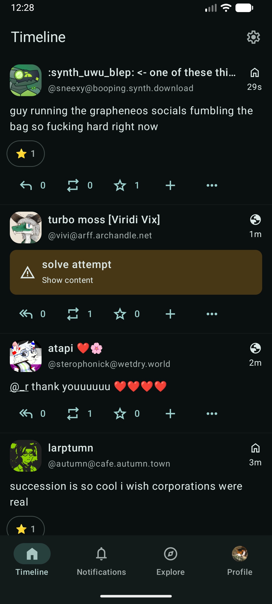
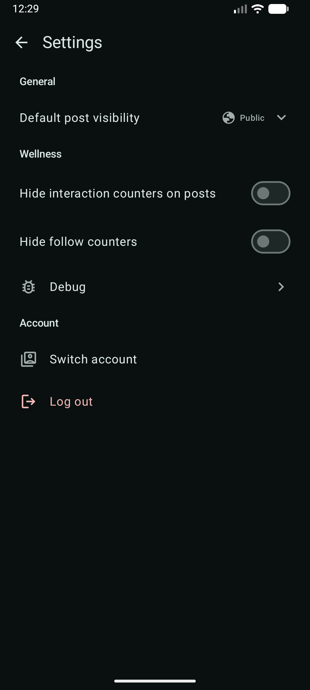
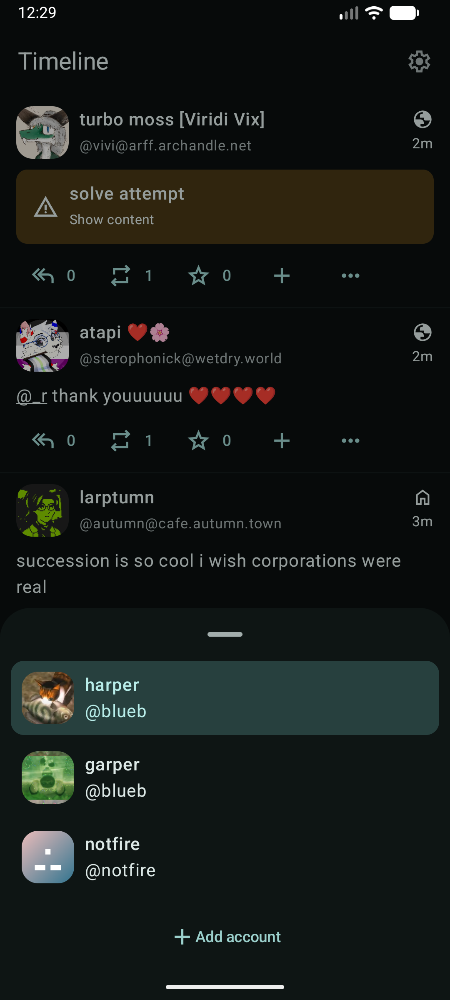
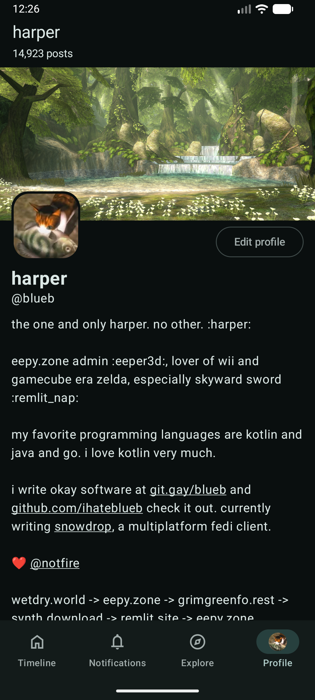
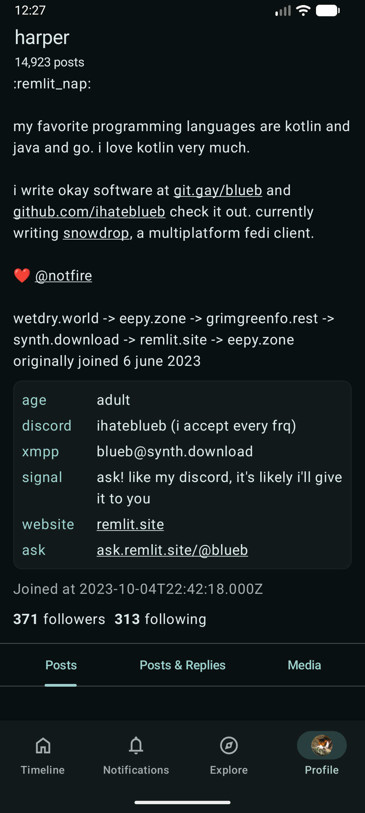

# Snowdrop

An attempt to make a Mastodon client that is multiplatform (iOS and Android)
and supports extensions brought by Mastodon API compatible software
like Iceshrimp.NET.

Uses Material 3 (supporting dynamic color schemes) for UI and icons.

## Screenshots

	
	
	
	
	

## Contributing

You can see instructions and helpful tips on contributing in `./CONTRIBUTING.md`.
Pull requests are welcome! Translations can also be submitted on our [Weblate](https://translate.codeberg.org/engage/snowdrop/).

## Acknowledgments
